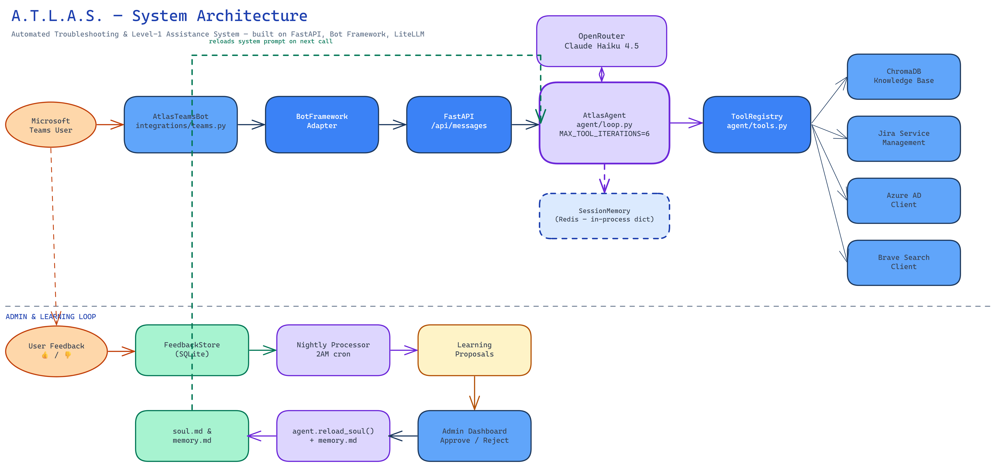
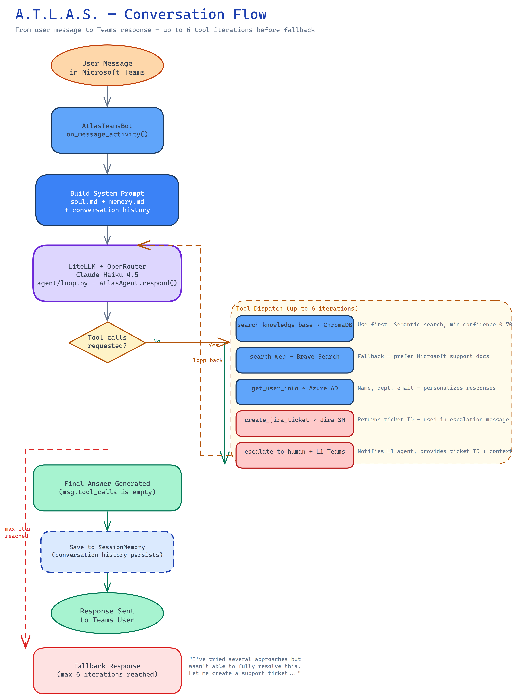
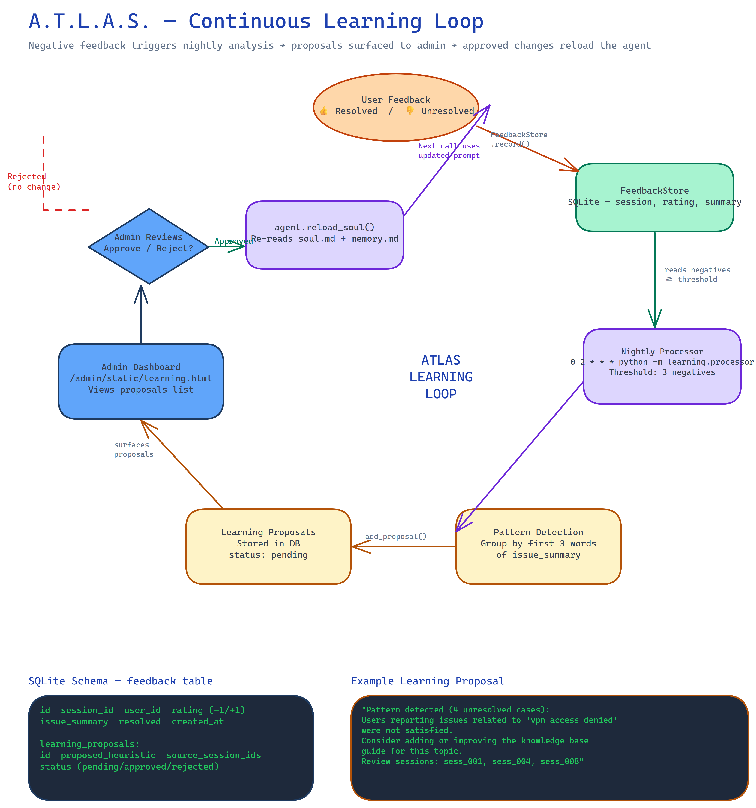

# A.T.L.A.S. — Automated Troubleshooting & Level-1 Assistance System

> **The heavy lifter that never drops the ball.**

A.T.L.A.S. is an AI-powered IT support assistant deployed as a Microsoft Teams bot. It handles Level-1 IT tickets autonomously — resolving common issues via a vector knowledge base, escalating unresolvable ones to Jira with full context, and continuously improving through a nightly feedback analysis loop.

---

## Table of Contents

- [Overview](#overview)
- [System Architecture](#system-architecture)
- [Conversation Flow](#conversation-flow)
- [Continuous Learning Loop](#continuous-learning-loop)
- [Key Components](#key-components)
- [Project Structure](#project-structure)
- [Configuration](#configuration)
- [Deployment](#deployment)
- [Admin Dashboard](#admin-dashboard)
- [Knowledge Base](#knowledge-base)
- [Development](#development)

---

## Overview

| Property | Value |
|----------|-------|
| **Channel** | Microsoft Teams (Bot Framework v4) |
| **LLM** | Claude Haiku 4.5 via OpenRouter (LiteLLM) |
| **Vector DB** | ChromaDB (persistent, cosine similarity) |
| **Ticketing** | Jira Service Management |
| **Identity** | Azure AD / Microsoft Graph |
| **Web Search** | Brave Search API |
| **Session Store** | Redis |
| **Feedback DB** | SQLite |
| **Framework** | FastAPI + uvicorn |
| **Deployment** | Docker Compose + Nginx + DigitalOcean |

### Core Heuristic: "No user left behind"

Every conversation ends with either a **resolution** or a **Jira ticket** — never silence. A.T.L.A.S. runs up to 6 tool-call iterations before falling back to human escalation.

---

## System Architecture

The diagram below shows all components and how they connect — from the Teams message arriving at the Bot Framework, through the agent core, out to external services, and through the admin/learning subsystem.



> Open [`docs/diagrams/architecture.excalidraw`](docs/diagrams/architecture.excalidraw) in [Excalidraw](https://excalidraw.com) to explore interactively.

### Component Summary

```
Microsoft Teams
    │
    ▼ HTTP POST /api/messages
Bot Framework Adapter  ←  MICROSOFT_APP_ID / APP_PASSWORD
    │
    ▼
FastAPI (main.py)
    │
    ▼
AtlasTeamsBot (integrations/teams.py)
    │  on_message_activity()
    ▼
AtlasAgent (agent/loop.py)
    │  litellm.acompletion() → OpenRouter → Claude Haiku 4.5
    │  MAX_TOOL_ITERATIONS = 6
    │
    ├──► search_knowledge_base  →  ChromaDB (cosine, threshold 0.70)
    ├──► search_web             →  Brave Search API
    ├──► get_user_info          →  Azure AD / Microsoft Graph
    ├──► create_jira_ticket     →  Jira Service Management
    └──► escalate_to_human      →  Teams L1 notification
    │
    ▼
SessionMemory (Redis)  ←  stores full conversation per session_id
```

---

## Conversation Flow

The diagram below traces a single user message from Teams all the way through the agent's tool-calling loop and back to the user.



> Open [`docs/diagrams/conversation-flow.excalidraw`](docs/diagrams/conversation-flow.excalidraw) in Excalidraw to explore interactively.

### Step-by-Step

1. **User sends a message** in a Teams chat with A.T.L.A.S.
2. **AtlasTeamsBot.on_message_activity()** receives the activity, extracts `user_id` and `session_id`, sends a typing indicator.
3. **AtlasAgent.respond()** is called. On the first turn, the system prompt is built from `soul.md` + `memory.md` + any conversation history from SessionMemory.
4. **LiteLLM → OpenRouter → Claude Haiku 4.5** generates a response. If tool calls are present, the loop continues (up to 6 iterations).
5. **Tool dispatch** via `ToolRegistry`:
   - `search_knowledge_base` — semantic search in ChromaDB, confidence ≥ 0.70
   - `search_web` — Brave Search fallback, prefer Microsoft support docs
   - `get_user_info` — Azure AD user profile for personalisation and ticket pre-fill
   - `create_jira_ticket` — escalation with full context, returns ticket ID
   - `escalate_to_human` — notifies an L1 agent in Teams
6. **Final answer** is appended to the conversation and saved to SessionMemory.
7. **Fallback**: if 6 iterations exhaust without a final answer, a fallback message is returned and a ticket is suggested.

### Agent Persona (soul.md)

A.T.L.A.S. has a defined identity loaded as its system prompt:

- **Supportive and patient** — never makes users feel embarrassed
- **Direct but warm** — gets to solutions quickly without being robotic
- **Transparent** — always tells users what it's doing and why
- **Numbered steps** for any multi-action procedure
- **Ends resolved sessions** with a 👍 / 👎 feedback prompt

---

## Continuous Learning Loop

The diagram below shows how negative user feedback flows into the nightly processor and eventually improves A.T.L.A.S.'s system prompt.



> Open [`docs/diagrams/learning-loop.excalidraw`](docs/diagrams/learning-loop.excalidraw) in Excalidraw to explore interactively.

### How It Works

| Step | Component | Detail |
|------|-----------|--------|
| 1 | **User rates the resolution** | 👍 (+1) or 👎 (−1) captured via `FeedbackStore.record()` |
| 2 | **SQLite stores the rating** | `session_id`, `user_id`, `rating`, `issue_summary`, `resolved` |
| 3 | **Nightly cron at 2AM** | `python -m learning.processor` |
| 4 | **Pattern detection** | Groups negatives by first 3 words of `issue_summary` |
| 5 | **Threshold check** | Minimum 3 negatives + minimum 2 per group before proposing |
| 6 | **Proposal created** | Written to `learning_proposals` table, status = `pending` |
| 7 | **Admin Dashboard** | `/admin/static/learning.html` — view, approve, or reject |
| 8 | **If approved** | `agent.reload_soul()` re-reads `soul.md` + `memory.md` |
| 9 | **Next session** | Agent uses updated instructions automatically |

### Cron Setup

```bash
# Add to crontab on the server
0 2 * * * cd /app && python -m learning.processor >> /var/log/atlas-learning.log 2>&1
```

---

## Key Components

### `agent/loop.py` — AtlasAgent

The core reasoning loop. Uses LiteLLM to call the configured model with tool definitions, processes tool calls iteratively, and falls back gracefully after `MAX_TOOL_ITERATIONS = 6`.

```python
REASONING_MODEL = "openrouter/anthropic/claude-haiku-4-5-20251001"
MAX_TOOL_ITERATIONS = 6
```

System prompt is built once per session from:
- `agent/soul.md` — agent identity, personality, communication rules
- `agent/memory.md` — operational heuristics (admin-approved learnings)

### `agent/tools.py` — ToolRegistry

Defines 5 tools exposed to the LLM via the OpenAI tool-use protocol, and routes calls to the right integration client:

| Tool | Client | When to Use |
|------|--------|-------------|
| `search_knowledge_base` | ChromaDB | Always try first |
| `search_web` | Brave Search | If KB has no result |
| `get_user_info` | Azure AD | To personalise or pre-fill tickets |
| `create_jira_ticket` | Jira SM | When issue can't be resolved |
| `escalate_to_human` | Teams notification | When urgent human help is needed |

### `knowledge_base/store.py` — KnowledgeBase

ChromaDB wrapper with cosine similarity. Confidence is derived from distance: `confidence = 1 - (distance / 2)`. The threshold (`KB_CONFIDENCE_THRESHOLD`, default 0.70) filters out low-quality matches.

### `knowledge_base/loader.py` — Guide Loader

Reads markdown guides from `knowledge_base/guides/` and upserts them into ChromaDB on startup.

**Included guides:**
- `clear-browser-cookies.md`
- `chrome-profile-setup.md`
- `shared-mailbox-access.md`
- `email-setup-new-device.md`
- `password-reset.md`

### `learning/feedback_store.py` — FeedbackStore

SQLite-backed store with two tables:
- `feedback` — individual session ratings
- `learning_proposals` — AI-generated improvement proposals pending admin review

### `admin/routes.py` — Admin Dashboard

HTTP Basic Auth (`ADMIN_USERNAME` / `ADMIN_PASSWORD`). Exposes:

| Endpoint | Description |
|----------|-------------|
| `GET /admin/status` | Health, uptime, KB document count |
| `GET /admin/logs` | Recent application logs |
| `GET /admin/proposals` | Pending learning proposals |
| `POST /admin/proposals/{id}/approve` | Approve proposal, triggers `reload_soul()` |
| `POST /admin/proposals/{id}/reject` | Reject proposal |
| `GET /admin/guides` | List knowledge base guides |

---

## Project Structure

```
IT_Support Assistant/
├── main.py                    # FastAPI app, Bot Framework adapter, component wiring
├── config.py                  # All env vars with dotenv loading
├── requirements.txt
├── Dockerfile
├── docker-compose.yml         # app + redis + nginx
├── nginx/nginx.conf
│
├── agent/
│   ├── loop.py                # AtlasAgent — LiteLLM reasoning loop
│   ├── tools.py               # ToolRegistry + 5 tool definitions
│   ├── memory.py              # SessionMemory (Redis-backed)
│   ├── soul.md                # Agent identity & communication rules
│   └── memory.md              # Operational heuristics (admin-approved)
│
├── integrations/
│   ├── teams.py               # AtlasTeamsBot (Bot Framework ActivityHandler)
│   ├── jira.py                # Jira Service Management client
│   ├── azure_ad.py            # Azure AD / Microsoft Graph client
│   └── brave.py               # Brave Search API client
│
├── knowledge_base/
│   ├── store.py               # KnowledgeBase (ChromaDB wrapper)
│   ├── loader.py              # Loads guides/ into ChromaDB on startup
│   ├── chroma_db/             # Persistent vector store (gitignored)
│   └── guides/                # Markdown IT support guides
│       ├── clear-browser-cookies.md
│       ├── chrome-profile-setup.md
│       ├── shared-mailbox-access.md
│       ├── email-setup-new-device.md
│       └── password-reset.md
│
├── learning/
│   ├── feedback_store.py      # SQLite feedback + proposals store
│   ├── processor.py           # Nightly learning processor (cron)
│   └── feedback.db            # SQLite database (gitignored)
│
├── admin/
│   ├── routes.py              # FastAPI admin router (HTTP Basic Auth)
│   └── static/                # Admin HTML pages
│       ├── index.html         # Status dashboard
│       ├── logs.html          # Log viewer
│       ├── learning.html      # Proposals review
│       └── guides.html        # KB guide browser
│
├── tests/
│   ├── test_agent_loop.py
│   ├── test_agent_memory.py
│   ├── test_knowledge_base.py
│   ├── test_integrations.py
│   ├── test_learning.py
│   ├── test_main.py
│   └── test_tools.py
│
└── docs/
    ├── deployment/
    │   ├── azure-bot-registration.md
    │   └── droplet-deploy.md
    └── diagrams/
        ├── architecture.excalidraw
        ├── conversation-flow.excalidraw
        └── learning-loop.excalidraw
```

---

## Configuration

Copy `.env.example` to `.env` and fill in all values:

```bash
cp .env.example .env
```

| Variable | Required | Description |
|----------|----------|-------------|
| `MICROSOFT_APP_ID` | Yes | Azure Bot registration app ID |
| `MICROSOFT_APP_PASSWORD` | Yes | Bot app secret |
| `OPENROUTER_API_KEY` | Yes | OpenRouter API key for LLM access |
| `JIRA_BASE_URL` | Yes | e.g. `https://yourcompany.atlassian.net` |
| `JIRA_EMAIL` | Yes | Service account email |
| `JIRA_API_TOKEN` | Yes | Jira API token |
| `JIRA_PROJECT_KEY` | No | Default: `IT` |
| `AZURE_TENANT_ID` | Yes | Azure AD tenant ID |
| `AZURE_CLIENT_ID` | Yes | App registration client ID |
| `AZURE_CLIENT_SECRET` | Yes | App registration secret |
| `BRAVE_SEARCH_API_KEY` | Yes | Brave Search API key |
| `REDIS_URL` | No | Default: `redis://localhost:6379` |
| `ADMIN_USERNAME` | Yes | Admin dashboard username |
| `ADMIN_PASSWORD` | Yes | Admin dashboard password (change from default!) |
| `KB_CONFIDENCE_THRESHOLD` | No | Default: `0.70` — minimum KB match confidence |
| `ESCALATION_ATTEMPT_THRESHOLD` | No | Default: `2` — max KB attempts before suggesting escalation |
| `PORT` | No | Default: `8000` |
| `LOG_LEVEL` | No | Default: `info` |

---

## Deployment

### Local Development

```bash
# Install dependencies
pip install -r requirements.txt
pip install -r requirements-dev.txt

# Set up environment
cp .env.example .env
# Fill in .env values

# Run
python main.py
```

### Docker Compose (Production)

The stack runs three containers: the app, Redis, and Nginx as a reverse proxy.

```bash
# Build and start
docker compose up -d --build

# View logs
docker compose logs -f app

# Run nightly learning processor manually
docker compose exec app python -m learning.processor
```

**Persistent volumes:**
- `kb_data` → ChromaDB vector store
- `learning_data` → SQLite feedback database
- `agent_data` → `soul.md` and `memory.md`
- `redis_data` → session history

### DigitalOcean Droplet

See [`docs/deployment/droplet-deploy.md`](docs/deployment/droplet-deploy.md) for full instructions including:
- Droplet sizing and initial setup
- Let's Encrypt SSL via Certbot
- Nginx configuration
- Cron job for nightly learning processor
- Azure Bot Framework webhook registration

### Azure Bot Registration

See [`docs/deployment/azure-bot-registration.md`](docs/deployment/azure-bot-registration.md) for creating the Bot registration in Azure Portal and configuring the Teams channel.

The bot's messaging endpoint must be:
```
https://your-domain.com/api/messages
```

---

## Admin Dashboard

Access at `https://your-domain.com/admin/` with `ADMIN_USERNAME` / `ADMIN_PASSWORD`.

| Page | URL | Purpose |
|------|-----|---------|
| Status | `/admin/` | Health check, uptime, KB doc count |
| Logs | `/admin/static/logs.html` | Recent log output |
| Learning | `/admin/static/learning.html` | Review and approve/reject proposals |
| Guides | `/admin/static/guides.html` | Browse knowledge base guides |

### Approving a Learning Proposal

1. Navigate to the **Learning** page
2. Review the heuristic text and the session IDs cited
3. Click **Approve** — this calls `agent.reload_soul()` which re-reads `soul.md` and `memory.md` for the next conversation
4. Or click **Reject** to dismiss the proposal

> **Note:** Approving a proposal does not automatically update `soul.md` or `memory.md`. It calls `agent.reload_soul()` which causes the agent to re-read those files. The IT admin must manually edit `agent/memory.md` with the appropriate heuristic before approving.

---

## Knowledge Base

Guides live in `knowledge_base/guides/` as markdown files. They are automatically loaded into ChromaDB on startup by `knowledge_base/loader.py`.

### Adding a New Guide

1. Create a markdown file in `knowledge_base/guides/`:

```markdown
# Title of the Guide

Brief description of when to use this guide.

## Steps

1. First step...
2. Second step...

## Notes

Any additional context.
```

2. Restart the app (or call the loader manually). The guide is upserted into ChromaDB with the filename as the document ID.

### Search Confidence

ChromaDB uses cosine distance. The KnowledgeBase converts this to a confidence score:

```python
confidence = 1.0 - (distance / 2.0)
```

Only results with `confidence >= KB_CONFIDENCE_THRESHOLD` (default 0.70) are returned to the agent. Adjust `KB_CONFIDENCE_THRESHOLD` in `.env` to tune precision vs. recall.

---

## Development

### Running Tests

```bash
pytest
```

### Test Configuration

Tests use an in-memory ChromaDB instance (`":memory:"`) and mock the external integrations (Jira, Azure AD, Brave Search) to avoid real API calls. See `pytest.ini` for configuration.

### Adding a New Tool

1. Add the tool definition to `TOOL_DEFINITIONS` in `agent/tools.py`
2. Add a handler method to `ToolRegistry`
3. Register it in the `handlers` dict inside `dispatch()`
4. Add any required integration client to the constructor
5. Wire it in `main.py`

### Editing the Agent Persona

Edit `agent/soul.md` directly. Changes take effect on the next conversation (the system prompt is built per-session).

For operational heuristics that should persist and be admin-reviewable, edit `agent/memory.md` instead — this is the file that the learning loop proposes changes to.

---

## Architecture Decisions

| Decision | Choice | Rationale |
|----------|--------|-----------|
| LLM routing | OpenRouter via LiteLLM | Single API key, easy model swapping, cost control |
| Vector DB | ChromaDB | Embedded, no extra service, cosine similarity natively |
| Tool iteration limit | 6 | Balances thoroughness with response time and cost |
| Feedback store | SQLite | Lightweight, no infrastructure, sufficient for v1 |
| Admin auth | HTTP Basic Auth | Simple, secure enough for internal tool |
| Session memory | Redis | Fast, TTL-capable, consistent across restarts |
| Confidence threshold | 0.70 | Empirically chosen to avoid low-quality KB matches |
